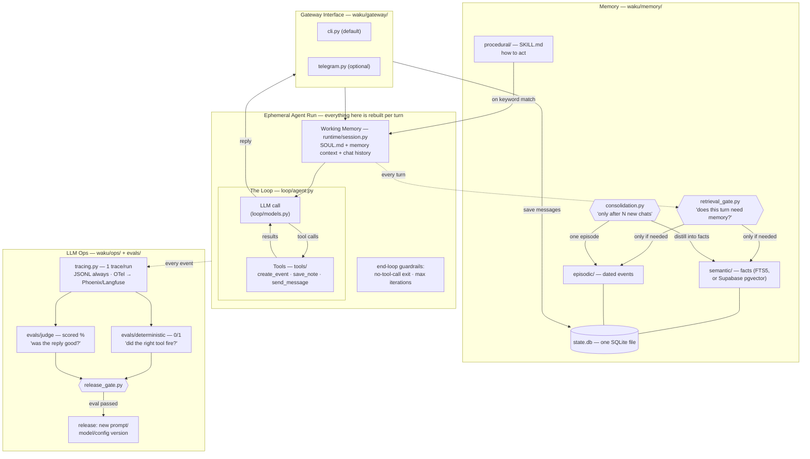
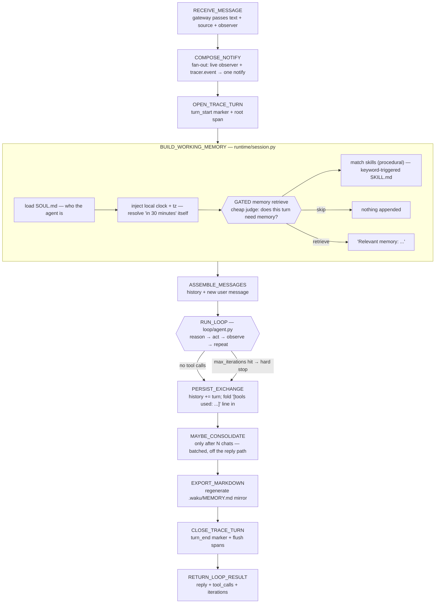
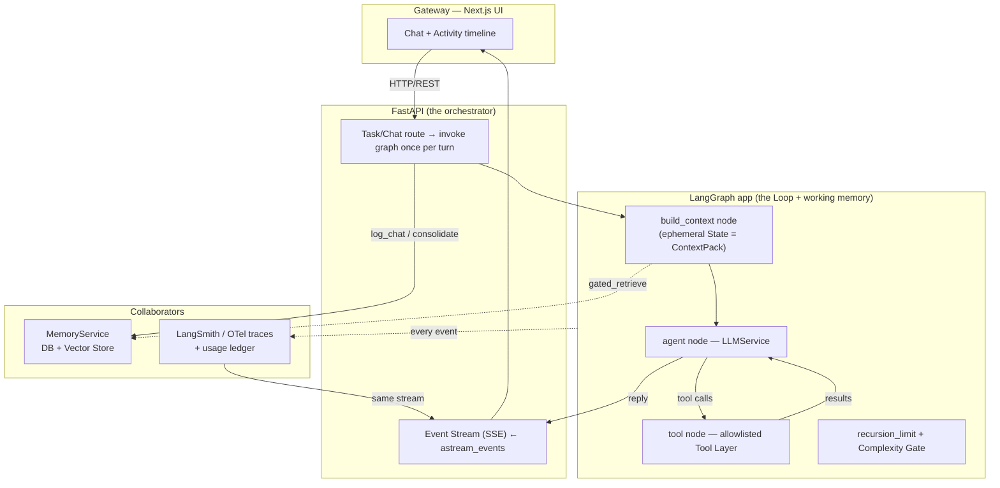

> [!IMPORTANT]
> **HARNESS ENGINEERING — WORKFLOW MVP (high-level reference)**
> This document explains **how a harness engineer builds the plumbing around an
> LLM loop**, using [`waku-agent`](../waku-agent) as the worked example. It follows the
> section structure of [`workflow-mvp-example.md`](./workflow-mvp-example.md), but the subject
> is the **Harness** pillar itself, not a domain app. Real file paths point at
> `waku-agent/` so every claim is checkable against code you can read in an afternoon.

# Harness Engineering Workflow MVP

## 0. What "harness" means here

An LLM by itself is a stateless text function: `text in → text out`. A **harness**
is everything you wrap around that function to turn it into a *running agent*:

```text
bare model call        →     agent turn
llm(prompt) -> text          gateway → assemble working memory → loop(reason/act)
                             → persist → trace → reply
```

`waku-agent` names four pillars — **Harness · Loop · Memory · Eval/LLM-Ops**. This
document is about the **Harness** pillar: the connective tissue that carries a
message from any input channel, assembles the exact context the model sees, runs
the reason→act loop, and records everything both *live* (for a human watching) and
*durably* (for traces and cost). The Loop, Memory, and Eval pillars are treated as
*collaborators the harness calls*, not as its internals.

Anchor files (waku-agent):

```text
waku/app.py               ← the orchestrator: assemble → loop → persist (start here)
waku/gateway/             ← cli / telegram / voice — channels that only move text
waku/runtime/session.py   ← working-memory assembly (the ephemeral run)
waku/loop/agent.py        ← the ~95-line loop the harness drives
waku/loop/models.py       ← provider abstraction (one dialect, many providers)
waku/tools/registry.py    ← the tool contract + safe execution
waku/ops/tracing.py       ← Observer/Tracer: show live + record durably
waku/config.py            ← every knob is one env var
```

---

## 1. Mục tiêu MVP (Goal of the harness MVP)

Build a **transparent, provider-agnostic harness** that takes text from any gateway
and runs one complete agent turn — assemble working memory → run the reason/act
loop → persist → trace — with the loop, memory, and provider all behind seams you
can swap.

The MVP proves four hypotheses:

1. **One turn, one place.** A single `respond()` entrypoint assembles context, runs
   the loop, persists the exchange, and emits a trace — no hidden control flow.
2. **Gateways are dumb.** CLI, Telegram, voice, and dashboard share *one brain*;
   each only moves text in/out and tags its `source`.
3. **The model is a swappable part.** Five providers plug in behind one wire
   dialect; changing provider is an env var, not a rewrite.
4. **Everything is both shown and recorded.** The same event stream feeds a live UI
   *and* a durable JSONL/OTel trace — the harness is observable by construction.

The measure of success is the README's promise: **readable in an afternoon**. If a
component makes the turn harder to follow, it does not belong in the harness core.

---

## 2. Kiến trúc tổng thể (Overall architecture)

This is the waku-agent whiteboard with a file path on every box (source:
[`waku-agent/docs/architecture.md`](../waku-agent/docs/architecture.md)). The **Harness**
is the `GW` + `RUN` region (Gateway → Ephemeral Agent Run → Loop → Tools); `MEM` and
`OPS` are the collaborators it *calls*.



The harness owns **assembly, driving the loop, and recording**. It does *not* own
memory internals, tool implementations, or the model's wire format — those sit
behind interfaces:

```python
Gateway        # moves text; calls Waku.respond(msg, observer, source)
Session        # build_system() + add_exchange() — assembles the ephemeral run
ModelClient    # anything with .messages.create(...) in the Anthropic shape
ToolRegistry   # schemas() + execute(name, args) — safe tool dispatch
Observer       # (kind, event) -> None — live view
Tracer         # same signature as Observer, plus turn()/end_turn() — durable
Memory         # gated_retrieve / matching_skills / log_chat / maybe_consolidate
Settings       # one dataclass of env vars
```

Because each is an interface, the orchestration can be re-implemented (or the model,
or the store) without rewriting the others. That is the whole point of a harness.

---

## 3. State machine chính (The turn lifecycle)

One call to `Waku.respond()` walks this machine. Compare to `waku/app.py:42`.



Two properties make this a *harness* and not just a script:

- **The whole turn is bracketed by one trace context** (`with self.tracer.turn(...)`),
  so a killed process still leaves a readable partial trace.
- **Persist / consolidate / export happen after the reply is known but inside the
  same turn** — the harness owns the "what to do with the result" step, not the loop.

---

## 4. Vai trò của các thành phần (Roles of harness components)

### Gateway (`waku/gateway/`)

The thinnest possible layer: read text in, print text out, and pass a `source` tag.
The CLI gateway is ~50 lines; Telegram is "the same ~60 lines with polling instead
of `input()`." A gateway **never** touches memory, tools, or the model — it calls
`waku.respond(msg, observer=_observer, source="cli")` and displays the reply.

The gateway also supplies a **live observer** — a `(kind, event) -> None` function
that prints tool calls, gate decisions, and consolidation as they happen. That is
the "transparent harness" beat: you watch the internals stream by.

### Orchestrator (`waku/app.py` — `Waku.respond`)

The one place the whole system is assembled: `config → db → tools → memory →
session → loop`. `respond()` is the turn's spine (Section 3). Its key move is
`compose(observer, self.tracer.event)` — **one** `notify` that fans every loop event
out to both the live view and the durable trace. Live and recorded never drift.

### Session / Working-Memory Assembler (`waku/runtime/session.py`)

Builds the *ephemeral run*: the system prompt (SOUL.md), the injected clock, the
**gated** memory block, matching skills, and the running chat history. Everything
here is rebuilt per turn and thrown away; what persists lives in `waku/memory`. It
also records each exchange, folding a compact `[tools used: ...]` line into history
so the model doesn't re-run a tool it already called.

### Loop runner (`waku/loop/agent.py`)

Not "owned" by the harness — *driven* by it. `run_loop()` takes a client, a system
prompt, messages, a tool registry, and an observer, and returns a `LoopResult`. The
harness supplies all of those and interprets the result. (Details in Section 7.)

### ModelClient adapter (`waku/loop/models.py`)

Turns "which provider" into a client the loop can call without caring. See Section 5.

### ToolRegistry (`waku/tools/registry.py`)

Holds the tool contract and runs tool calls **safely** (errors become text the model
observes, never a crash). See Section 11.

### Tracer / Observer (`waku/ops/tracing.py`)

Doubles as a loop observer: pass `tracer.event` anywhere an observer goes and every
step lands in the trace. Also brackets the turn and keeps the permanent cost ledger.
See Section 16.

---

## 5. Provider abstraction (One dialect, many providers)

The single most reusable harness pattern: **the loop speaks exactly one wire
dialect** (Anthropic's Messages shape — `system` / `messages` / `tools` in, content
blocks out), and providers plug in at the edge.

```text
anthropic wire format (native)     → Anthropic, Kimi/Moonshot, GLM/Z.ai
openai wire format (thin adapter)  → OpenAI, Google Gemini
```

The provider table is data, not code paths (`waku/loop/models.py`):

```python
PROVIDERS = {
  "anthropic": Provider("anthropic", "ANTHROPIC_API_KEY", None, "<main>", "<small>"),
  "openai":    Provider("openai",    "OPENAI_API_KEY",    None, "<main>", "<small>"),
  "gemini":    Provider("openai",    "GEMINI_API_KEY",    "<base_url>", "<main>", "<small>"),
  "kimi":      Provider("anthropic", "MOONSHOT_API_KEY",  "<base_url>", "<main>", "<small>"),
  "glm":       Provider("anthropic", "ZHIPU_API_KEY",     "<base_url>", "<main>", "<small>"),
}
```

Design rules a harness engineer should copy:

- **Two models per provider: main + small.** The loop uses the main model; the
  retrieval gate and consolidation use the cheap `small_model`. Routing is by *job*,
  not by a hard-coded id.
- **Model ids are just strings**, overridable via `WAKU_MODEL` / `WAKU_SMALL_MODEL`,
  so a model aging out never touches code.
- **One adapter absorbs the format gap.** `OpenAICompatClient` (~60 lines) maps
  Anthropic-shaped calls onto OpenAI `chat.completions`, including streaming and the
  `max_tokens` vs `max_completion_tokens` fallback. The loop is oblivious.
- **Fail fast on config, timeout on network.** Unknown provider or missing key →
  `SystemExit` with a fix hint; every call carries a timeout so a hung request never
  freezes a turn silently.

```yaml
# routing is by role, resolved from one env var — never hard-coded in loop logic
provider:     ${WAKU_PROVIDER}      # anthropic | openai | gemini | kimi | glm
main_model:   ${WAKU_MODEL}         # the loop
small_model:  ${WAKU_SMALL_MODEL}   # retrieval gate + consolidation
```

---

## 6. Working-memory contract (the ContextPack of the harness)

Every turn, the Session builds *exactly* the context the model will see. Nothing
implicit, nothing global. The contract (`Session.build_system`):

```yaml
working_memory:
  soul:            SOUL.md            # persona + standing rules (editable file)
  clock:           "Right now it is <local time> (<tz>)"   # injected, never asked
  gated_memory:    "Relevant memory: ..."  | (omitted if gate says skip)
  skills:          "Relevant skill instructions: ..." | (omitted if none match)
messages:
  history:         [ {role, content}, ... ]   # this session's prior turns
  new_message:     { role: user, content: <user_message> }
```

Two decisions worth stealing:

- **Inject the environment the model can't see.** The laptop clock goes *into* the
  prompt so the model resolves relative time itself, instead of asking the user
  ("what time is it?") — a real bug the harness fixes by construction.
- **Memory is gated, not default-on.** The block only appears when a cheap judge says
  the turn needs it. Default-on retrieval is slow *and* biases answers with
  irrelevant facts. The harness calls `memory.gated_retrieve(...)`; it doesn't know
  how the gate decides.

The system prompt is a **join of parts**, each optional — the assembler adds a
section only when it has content. That keeps the token budget honest per turn.

---

## 7. Loop guardrails & exit conditions

The harness drives the loop but the loop owns its own termination. `run_loop`
(`waku/loop/agent.py`) is the canonical shape:

```python
for iteration in range(1, max_iterations + 1):
    response = llm(messages, tools)          # reason (stream or single call)
    messages.append(assistant_turn)          # the turn joins working memory
    tool_uses = [b for b in response if b.type == "tool_use"]
    if not tool_uses:                        # ── guardrail 1: natural end
        return LoopResult(reply=text, iterations=iteration)
    for call in tool_uses:                   # act
        output = tools.execute(call.name, call.input)
        notify("tool", {...})                # observe (live + trace)
    messages.append(tool_results)            # feed results back as working memory
# ── guardrail 2: ran out of iterations → hard stop, honest message
return LoopResult(reply="(hit my iteration limit ...)")
```

Harness-level guarantees around it:

| Failure mode | Guardrail |
|---|---|
| Model never stops calling tools | `max_iterations` (default 10) → hard stop, never spins forever |
| A tool raises | `ToolRegistry.execute` returns the error as text; loop continues, model can retry |
| Streaming hiccup | `stream=True` path falls back to a single `create()` call on any exception |
| Hung network call | client-level timeout (`WAKU_LLM_TIMEOUT`) |
| Cost/size runaway | `max_tokens` per call |

`max_iterations` and `max_tokens` are **harness config** (Section 17), not loop
constants — the harness owns the safety envelope; the loop owns the algorithm.

---

## 8. Observability artifacts (what the harness writes)

A harness is judged by what you can read *after* a turn. `waku-agent` writes four
kinds of artifact, each with a distinct job:

```text
.waku/traces/<date>.jsonl   ← per-turn event log: turn_start → llm → tool → turn_end
.waku/usage.jsonl           ← PERMANENT cost ledger (tokens), never wiped on reset
.waku/MEMORY.md             ← human-readable mirror of durable memory, re-exported each turn
.waku/state.db              ← the queryable source of truth (facts, episodes, chat log)
```

Rules that make these trustworthy:

- **Traces are resettable; the cost ledger is not.** You can wipe traces for a clean
  demo, but `usage.jsonl` is append-only — the number you show is your real total.
- **Store ground truth, derive the rest.** Tokens are recorded (ground truth); dollar
  cost is *derived* on the dashboard, because pricing changes but token counts don't.
- **A trace is just "what happened, in order."** Zero dependencies to read it — open
  the JSONL. OTel spans are an *optional* second output of the same events.
- **The markdown mirror is a convenience, not the source.** `state.db` is queryable;
  `MEMORY.md` is the openable view regenerated after every turn.

---

## 9. The dashboard — watch the harness think

The harness's live face is a tiny local web server you own (`127.0.0.1`, no cloud);
the browser is just UI, and the same process runs every turn. It exists so a human
can *see* the harness, which is the fastest way to understand it.

```text
Overview   cost · latency · gate skip/retrieve split · clickable architecture map
Gateway    one conversation across channels, each message tagged (cli/telegram/voice/dashboard)
Loop       every turn: gate decision, tool calls, iteration count, tokens, cost
Memory     semantic facts · episodes · editable skills + SOUL · consolidation
Tools      available tools grouped by origin, results, MCP connectors
Data       live SQLite browser over state.db (schema + read-only SQL console)
Ops        eval verdict + history · gate decisions · slowest turns · inline traces
```

The engineering point: the dashboard is **just another gateway + another observer**.
It calls the same `respond()` with `stream=True` and subscribes to the same event
stream. Nothing about the harness core is dashboard-specific — proof the observer
seam is real.

---

## 10. Error handling & fallback policy

The harness's job is to keep a turn *honest* under failure, never to hide it.

### Recover silently (transparent to the user, visible in trace)

```text
Streaming error         → fall back to one non-streaming call
Tool raises             → return "Error running <tool>: <exc>" as tool result; model retries
Older OpenAI endpoint   → retry with max_tokens instead of max_completion_tokens
Consolidation fails     → chat log stays unconsolidated (loss-safe), reply unaffected
```

### Fail fast (a human must fix config)

```text
Unknown WAKU_PROVIDER   → SystemExit with the valid list
Missing API key         → SystemExit naming the env var to set
```

### Degrade honestly (tell the user)

```text
max_iterations reached  → "(I hit my iteration limit — try smaller steps.)"
LLM timeout             → surfaced, not swallowed
```

The rule: **recoverable mechanics recover quietly and get traced; misconfiguration
stops immediately; a genuinely stuck turn returns an honest message.** Never a
silent freeze.

---

## 11. Tool registry & the tool contract

A tool is three things, no more (`waku/tools/registry.py`):

```python
@dataclass
class Tool:
    name: str                    # what the model reads
    description: str             # when to use it (the model's only guidance)
    input_schema: dict           # JSON schema for arguments
    fn: Callable[..., str]       # runs it; returns a string the model observes
```

The registry gives the harness two operations:

```python
tools.schemas()             # → the `tools=` payload for the model call
tools.execute(name, args)   # → run one call SAFELY
```

Safety is the harness's contribution:

```python
def execute(self, name, args):
    tool = self._tools.get(name)
    if tool is None:
        return f"Error: unknown tool '{name}'"     # unknown tool → text, not crash
    try:
        return tool.fn(**args)
    except Exception as exc:
        return f"Error running {name}: {exc}"       # tool bug → text, model can retry
```

Because a failed tool becomes an *observation* (text back into the loop), the loop
never crashes on a tool bug — it reasons about the error like any other result. Tools
are registered at assembly time (`build_registry`) and can come from local functions
or MCP servers, namespaced `<server>_<tool>` — same contract either way.

---

## 12. Gateway contract — adding a channel

The reason five channels share one brain: they all satisfy the same tiny contract.

```text
A gateway MUST:
  1. obtain user text (input(), long-poll, mic, HTTP)
  2. call  waku.respond(text, observer=<live view>, source="<channel>")
  3. render result.reply

A gateway MUST NOT:
  - touch memory, tools, or the model
  - own any turn logic
```

`source` is the only channel-specific data that flows inward — it tags each chat-log
row so the unified conversation can show origin (`cli` / `telegram` / `voice` /
`dashboard`). Adding a gateway is therefore *purely additive*: write the I/O loop,
pass a `source`, done. The Telegram gateway is the CLI gateway with polling; the
dashboard is an HTTP server with `stream=True`. No core change.

```python
# the entire "new gateway" surface
def _observer(kind, event): ...          # optional: show internals live
result = waku.respond(text, observer=_observer, source="mychannel")
print(result.reply)
```

---

## 13. Determinism seams — making the harness testable

A harness that can't be tested offline is a liability. `waku-agent` builds two
**injection seams** into the orchestrator so evals and the dashboard reuse the exact
same code path:

```python
class Waku:
    def __init__(self, settings=None, client=None, conn=None):
        # client: evals swap in a SCRIPTED model → deterministic loop behavior
        # conn:   the dashboard injects a cross-thread SQLite connection
        self.client = client or get_client(self.settings)
        self.conn   = conn   or connect(self.settings.home)
```

Why this matters for a harness engineer:

- **Deterministic tests drive real turns.** A scripted client makes "did the right
  tool fire?" a 0/1 unit test — the loop, tool dispatch, and persistence all run for
  real; only the model is faked.
- **One seam, many callers.** The same constructor arg serves evals and the
  dashboard. No test-only branch inside `respond()`.

The lesson: put the swap at the **edge** (client, connection), keep the **middle**
(assemble → loop → persist) identical for prod and test. That is what makes the
harness both real and verifiable.

---

## 14. The harness ↔ memory boundary

Memory is a *collaborator*, and the boundary is deliberately narrow. The harness
knows exactly four calls (`waku/app.py`, `waku/runtime/session.py`):

```python
memory.gated_retrieve(user_message, notify=...)   # in build_system — may return ""
memory.matching_skills(user_message)              # in build_system — procedural
memory.log_chat(user_message, record, source=...) # in add_exchange — persist turn
memory.maybe_consolidate(notify=...)              # after reply — batched distillation
```

Everything behind those calls — FTS5 vs pgvector, the gate model, the consolidation
summarizer, the schema — is invisible to the harness. Consequences:

- **The gate lives in memory, not the harness.** The harness just calls
  `gated_retrieve`; whether it skips or retrieves is memory's decision, surfaced as a
  `gate` event on the same stream.
- **Consolidation is off the reply path.** The harness calls `maybe_consolidate`
  *after* the reply is returned to history, batched ("after N chats"), and loss-safe.
- **Swapping the store is a memory concern.** `WAKU_SEMANTIC_STORE=supabase` changes
  the backend without touching a line of `respond()`.

This is the same discipline as the provider seam: the harness depends on an
*interface* (four verbs), never an implementation.

---

## 15. Context assembly & token budget

The harness never ships "all of memory + all of history" into every call. Instead:

```text
per-turn rebuild   working memory is assembled fresh, then discarded (ephemeral run)
gate before load   memory is retrieved ONLY when the cheap judge says it's needed
optional sections  each system-prompt part is added only if it has content
role-scoped models the small model runs the gate/consolidation; the main model runs the loop
history folding    past tool activity is compressed to one "[tools used: ...]" line
```

Priority of what enters the prompt (highest first), mirroring the ephemeral-run
philosophy:

```text
current user message
> injected environment (clock, timezone)
> persona + standing rules (SOUL.md)
> gated relevant memory (only if the gate retrieved)
> matching skills (only on keyword match)
> this session's chat history
```

The budget discipline is structural: because context is *assembled per turn from
parts*, cutting a part (skip retrieval, no matching skill) automatically shrinks the
call. There is no giant always-on context to trim.

---

## 16. The event stream (observer + tracer)

This is the harness's nervous system. One event stream serves *both* the live view
and the durable record, guaranteed identical by construction:

```python
notify = compose(observer, self.tracer.event)   # fan one event out to N sinks
```

Event kinds on the stream:

```text
turn_start   the turn began (user_message)
gate         retrieval decision (skip | retrieve, + reason)      ← from memory
llm          one model call (iteration, stop_reason, token usage)
text         streaming token delta (live UI only — NOT written to trace)
tool         a tool ran (name, args, output)
consolidation  memory distilled N new facts
turn_end     reply + iteration count
```

Two outputs from the *same* events (`waku/ops/tracing.py`):

1. **JSONL, always on** — append `{type, ...}` per event to `traces/<date>.jsonl`.
   Zero setup; open and read the agent's turn in order.
2. **OpenTelemetry spans, when an endpoint is set** — the same events as a span tree
   for Phoenix or Langfuse. The instrumentation doesn't know which backend.

Design rules:

- **`text` deltas are for humans, not the trace** — the tracer drops them so the log
  stays "what happened," not a token-by-token replay.
- **Usage is recorded on every `llm` event** into the permanent ledger, separate from
  the resettable trace.
- **One turn = one root span + `turn_start`/`turn_end` markers**, flushed per turn so
  a killed process still yields a readable trace.

---

## 17. Tech stack MVP (harness)

```yaml
language: Python (stdlib-first)

orchestration:
  entrypoint: waku/app.py (Waku.respond)   # plain Python, no framework
  loop:       ~95 lines (waku/loop/agent.py)

gateways:
  cli:      rich (terminal)
  telegram: long-polling (optional extra)
  voice:    whisper wake-word + local TTS (optional extra)
  dashboard: stdlib HTTP server (localhost:7777)

model_access:
  dialect:   Anthropic Messages shape
  native:    anthropic, kimi, glm
  adapter:   openai  → OpenAICompatClient (openai sdk)  → openai, gemini
  routing:   env vars (WAKU_PROVIDER / WAKU_MODEL / WAKU_SMALL_MODEL)

state:
  store:     SQLite + FTS5 (state.db)         # upgrade path: Supabase pgvector
  home:      ./.waku (traces, outbox, usage ledger, MEMORY.md mirror)

observability:
  always:    JSONL traces + append-only usage.jsonl
  optional:  OpenTelemetry → Phoenix / Langfuse

config:
  everything: one dataclass of env vars (waku/config.py), read once at startup

not-in-mvp:
  - no LangGraph / agent framework
  - no multi-agent / sub-agents
  - no message queue, no k8s
```

The stack's north star: **every layer has a boring, zero-signup default and a
documented upgrade** (FTS5 → pgvector, JSONL → Phoenix, mock calendar → real).

---

## 18. Verifying the harness

The Eval pillar checks the *agent*; here we call out what a harness engineer should
verify about the *plumbing* specifically. Reuse the determinism seam (Section 13).

### Harness-level checks (deterministic, 0/1)

```text
turn wiring       respond() emits turn_start ... turn_end for every call
source tagging    each gateway's messages carry the right `source`
tool safety       a raising tool yields a text error, not an exception
guardrail 1       a no-tool response ends the turn (iter 1)
guardrail 2       a tool-happy scripted model stops at max_iterations
provider adapter  an OpenAI-shaped response maps to the Anthropic content-block shape
working memory    the injected clock is present so the model never asks the time
persistence       history gets the "[tools used: ...]" line; chat_log row is written
cost ledger       every llm event appends one usage.jsonl row
```

### The bug workflow (the discipline to show)

When you catch a harness bug by using it live, you **fix it AND add a deterministic
case** so it can't return. The repo's canonical example is exactly a harness bug: the
agent didn't know the current time and asked for it before scheduling — fixed in
`session.py`, locked forever by a regression test. Run the release gate → green.

Keep deterministic checks ("did the wiring do the thing") strictly separate from
judged checks ("was the reply good"). Conflating them is the most common eval mistake.

---

## 19. Implementation roadmap (vertical slices)

Each ticket is a demoable slice, not a horizontal layer.

### Ticket 1 — Config + home + one model client

`Settings` dataclass, `.waku/` home dirs, `get_client()` for one provider. Prove: a
single hard-coded `llm(messages)` call returns text. No blocker.

### Ticket 2 — The loop + tool registry

`run_loop` with both guardrails, `Tool`/`ToolRegistry` with safe `execute`. Prove: a
one-tool turn shows `iter 2` (reason → act → reason). Blocked by Ticket 1.

### Ticket 3 — Orchestrator + working-memory assembly

`Waku.respond` and `Session.build_system` (SOUL + clock + history). Prove: multi-turn
conversation with memory of the last exchange. Blocked by Ticket 2.

### Ticket 4 — Observer + tracer (the event stream)

`compose()`, `Tracer` (JSONL + usage ledger), the live CLI observer. Prove: read a
turn back from `traces/<date>.jsonl`. Blocked by Ticket 3.

### Ticket 5 — CLI gateway

The thin channel calling `respond()`. Prove: a real conversation in the terminal with
tool calls streaming by. Blocked by Ticket 4.

### Ticket 6 — Provider abstraction

`OpenAICompatClient` + the `PROVIDERS` table. Prove: same conversation on a second
provider via one env var. Blocked by Ticket 1 (lands anytime after).

### Ticket 7 — Memory boundary

Wire `gated_retrieve` / `log_chat` / `maybe_consolidate` (memory internals are a
separate pillar). Prove: "remember X" → restart → recalled. Blocked by Ticket 3.

### Ticket 8 — Determinism seam + harness evals

Injectable `client`/`conn` + the Section-18 deterministic checks + a release gate.
Prove: `make gate` green. Blocked by Ticket 7.

### Ticket 9 — Dashboard + OTel

The local cockpit (another gateway + observer) and optional OTel export. Prove: watch
a turn light up live; view the same turn as a span tree. Blocked by Ticket 5.

---

## 20. Good for Later

- **Sub-agents / `delegate_task`** — multi-agent coordination (kept out to keep the
  core single-agent and readable).
- **Terminal tool / `run_command`** — needs a real sandbox + safety surface first.
- **Browser tool / `browse_web`** — full browsing beyond read-only `search_web`.
- **Cron / `schedule_task`** — scheduled runs beyond a system cron line.
- **pgvector semantic memory** — swap FTS5 for Supabase pgvector behind the same
  four-verb memory boundary.
- **Span-waterfall as default** — promote OTel/Phoenix from optional to first-class.
- **Streaming everywhere** — extend `stream=True` beyond the dashboard.
- **Backpressure / rate-limit policy** across gateways sharing one brain.
- **Structured redaction** before exporting traces that contain sensitive payloads.

This scope is small enough to build in a night yet exercises the whole harness value
chain: **receive from any channel → assemble the exact context → drive the loop with
guardrails → dispatch tools safely → call memory across a narrow seam → record every
event both live and durably → return an honest reply.**

---

## 21. Appendix — how this maps onto the AI-HACKATHON-TEMPLATE stack (FastAPI/LangGraph)

waku-agent is plain Python; this template is **FastAPI + LangGraph + Next.js + a
DB/vector store** (see [`ARCHITECTURE.md`](./ARCHITECTURE.md), [`WORKFLOW-MVP.md`](./WORKFLOW-MVP.md)).
The harness *concepts* transfer one-for-one — only the implementation vehicle
changes. The point of this appendix: **the harness is not a framework choice.** You
can build every seam above on top of LangGraph without losing the discipline.

### 21.1 Concept → template component

| Harness concept (waku) | Where it lives in this template |
|---|---|
| Gateway (`waku/gateway/`) | **Next.js UI + FastAPI routes** (Chat API · Event Stream SSE) — still only moves text; still tags a `source` |
| Orchestrator `Waku.respond()` | **A FastAPI service that invokes the LangGraph app** (`graph.invoke` / `astream`) once per turn |
| Ephemeral run / working memory (`session.py`) | **LangGraph `State` + a `build_context` node** — assembled per turn, not global; the template's `ContextPack` |
| The Loop (`loop/agent.py`) | **The LangGraph graph itself** — the reason→act cycle is the node/edge graph (`Agent → Tools → Agent`) |
| `max_iterations` / `max_tokens` guardrails | **`recursion_limit` on the graph** + per-call `max_tokens`; the Complexity Gate node |
| ModelClient abstraction (`models.py`) | **An `LLMService` wrapper** behind one interface (LangChain `init_chat_model` / provider config in `.env`) |
| ToolRegistry + safe `execute` | **The template's Tool Layer with an allowlist** — bind tools to the graph; wrap each in try/except that returns text |
| Observer + Tracer (`ops/tracing.py`) | **LangGraph streamed events (`astream_events`) → SSE to the UI** *and* **LangSmith/OTel traces** — same "shown AND recorded" fan-out |
| Memory boundary (four verbs) | **MemoryService + Vector Store + DB** behind `gated_retrieve / log / consolidate` calls from a graph node |
| Determinism seams (`client`, `conn`) | **Dependency injection in FastAPI** (`Depends`) + a scripted `FakeLLM` for pytest |
| `.waku/` artifacts | **PostgreSQL/SQLite tables + LangSmith run history**; the USER_INTENT/SPEC/PLAN artifacts of `WORKFLOW-MVP.md` |

### 21.2 The same turn, drawn on this stack



### 21.3 Translation rules (keep the discipline, swap the vehicle)

- **`respond()` becomes one graph invocation.** Keep it a *single* entrypoint —
  don't scatter turn logic across routes. FastAPI route → `graph.ainvoke(state)` →
  return reply. Everything in Section 3 becomes nodes/edges.
- **Working memory is LangGraph `State`, rebuilt per turn.** Resist stuffing durable
  data into `State`; it is the ephemeral run. Durable facts live in the DB/vector
  store and are pulled in by a `build_context` node — the template's `ContextPack`.
- **The loop's guardrails are `recursion_limit` + the Complexity Gate.** LangGraph
  gives you the loop; you still own the safety envelope (max steps, max tokens,
  auto-execute vs pause-for-review).
- **One event stream, two sinks — unchanged.** Use `astream_events` as your single
  `notify`: pipe it to the UI over SSE *and* to LangSmith/OTel. Don't build a
  separate "logging" path; live and recorded must come from the same events.
- **Tools stay a registry with an allowlist and safe execution.** Bind tools to the
  graph, but keep the "errors return as text, never crash the turn" rule from
  Section 11 — wrap each tool `fn`.
- **Keep determinism seams.** Inject the LLM client and DB session via FastAPI
  `Depends`; in tests pass a scripted `FakeLLM` so "did the right tool fire?" stays a
  0/1 check (Section 13, 18).
- **Provider routing stays one env var.** Use `init_chat_model(...)` /
  provider config so `LLM_PROVIDER` / `LLM_MODEL` swaps the model without touching
  graph code (Section 5).

### 21.4 What NOT to copy blindly

- **You don't need a dashboard to start.** The SSE activity timeline in the template
  UI already gives you "watch the harness think." Add LangSmith when you want the
  span waterfall.
- **Don't over-node the graph.** waku's whole loop is ~95 lines; a hackathon graph
  of 4–6 nodes (`intake → context → agent ⇄ tools → validate`) is plenty. Extra
  nodes are extra surface to debug at 2am.
- **Memory: gate before you retrieve.** The single highest-leverage borrow — add a
  cheap-model gate node before hitting the vector store, exactly as in Section 6.
  Default-on RAG is the most common hackathon latency/quality sink.
- **Sensitive data stays out of episodic memory** (per `WORKFLOW-MVP.md`): store task
  summaries, spec versions, and outcomes — never raw customer/bank/tax data.
