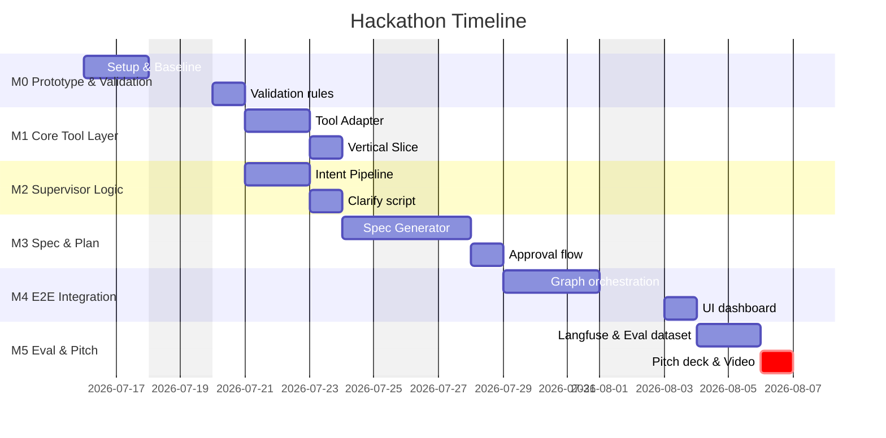

# Hackathon MVP Plan: [Project Name]

> **One-line Pitch:** [Tóm tắt 1 câu: Vấn đề -> Giải pháp AI cho Target User]
> **Source of Truth:** HACKATHON_BOILERPLATE.md (Copy to README.md or PLAN.md for new hackathons)

---

## Part 1: Product Definition (JTBD)

### 1. Project Snapshot
- **Tên dự án tạm thời:** [Project Name]
- **Nhóm/Lĩnh vực:** [AI Product / AI Engineering MVP]
- **Thị trường mục tiêu:** [Mô tả thị trường và đối tượng mục tiêu]
- **Bài toán đang giải quyết:** [Mô tả chi tiết pain point nghiệp vụ thực tế, định lượng thời gian/tiền bạc bị lãng phí]

### 2. Core JTBD
> **Khi** [bối cảnh / tình huống xảy ra],
> **tôi muốn** [AI Agent hỗ trợ hành động / đầu ra mong muốn],
> **để tôi có thể** [đạt được kết quả kinh doanh / nghiệp vụ mong đợi mà không gặp rào cản kỹ thuật].

### 3. Job Stories & MVP Map
- **Job Story 1 (Làm rõ):** Khi yêu cầu còn thiếu/mơ hồ, tôi muốn AI hỏi tối đa 2-3 câu hỏi cốt lõi để làm rõ intent.
- **Job Story 2 (Duyệt kế hoạch):** Khi tác vụ phức tạp/rủi ro cao, tôi muốn AI sinh Spec/Plan để tôi duyệt trước khi thực thi.
- **Job Story 3 (Thực thi an toàn):** Tôi muốn AI chỉ thao tác qua Tool Layer có kiểm soát (không chạy code tùy ý) và tự động validate kết quả.

| Job Step | User Action | AI Outcome |
|---|---|---|
| 1. Nhập yêu cầu | Nhập prompt ngôn ngữ tự nhiên | Trích xuất intent & entities |
| 2. Làm rõ thông tin | Trả lời câu hỏi làm rõ (<=3 câu) | Cập nhật intent & áp dụng default assumptions |
| 3. Duyệt kế hoạch | Review Spec/Plan dễ hiểu | Chặn thực thi nếu chưa Approve |
| 4. Thực thi | Đợi Agent gọi Tool Layer | Lưu log & xuất kết quả / file artifacts |
| 5. Kiểm thử nghiệp vụ | Nhận báo cáo validation tự động | Phát hiện lỗi logic, cảnh báo deviation |

### 4. Assumptions & Success Signals
- **Value Risk:** [Người dùng có sẵn sàng thay đổi quy trình cũ để dùng AI Agent này không?]
- **Usability Risk:** [Plan/Spec dễ đọc có giúp user dễ duyệt không? Câu hỏi làm rõ có phiền phức không?]
- **Feasibility Risk:** [Tool layer và validation có chạy ổn định, chính xác mà không gặp lỗi bảo mật/crash không?]
- **Success Signals:** 
  - Supervisor hỏi <= 3 câu hỏi làm rõ.
  - User phê duyệt Spec/Plan đạt tỷ lệ >= 80%.
  - Validation kiểm thử tự động phát hiện 100% lỗi nghiêm trọng trước khi bàn giao.

---

## Part 2: Project Management & Roadmap

### 1. Milestone Timeline
| Phase | Duration | Key Deliverable | Status |
|---|---|---|---|
| **M0 — Prototype & Baseline** | 2–3 days | Go/Pivot/Stop decision + validation rules | 🔲 Not started |
| **M1 — Core Tool Layer V0** | 3–4 days | Core API / Tool Adapter & Mock execution | 🔲 Not started |
| **M2 — Supervisor Intent V0** | 2–3 days | Intent Classifier & Clarification logic | 🔲 Not started |
| **M3 — Spec/Plan Review V0** | 3–4 days | Spec/Plan generator & User approval flow | 🔲 Not started |
| **M4 — End-to-End MVP Integration** | 4–5 days | LangGraph flow, Memory, and UI dashboard | 🔲 Not started |
| **M5 — Evaluation & Pitch Prep** | 2–3 days | Langfuse tracking, Eval dataset, Video Demo | 🔲 Not started |

### 2. Work Breakdown Structure (WBS)


### 3. Story / Ticket Registry
- **US-001 (Task & Trace):** Xây dựng database lưu trữ trạng thái Task và log Structured Activity Trace.
- **US-002 (Intent Classifier):** Nhận diện intent nghiệp vụ, trích xuất thực thể và kích hoạt clarification.
- **US-003 (Spec/Plan Gen):** Tạo spec nghiệp vụ (`SPEC.md`) và kế hoạch thực thi (`PLAN.md`).
- **US-004 (Approval Interrupt):** Cơ chế tạm dừng để chờ phê duyệt Spec/Plan từ phía User.
- **US-005 (Tool Execution Layer):** Wrapper/Adapter kiểm soát việc gọi các thư viện/công cụ ngoài.
- **US-006 (Deterministic Validation):** Chạy script kiểm thử dữ liệu đầu ra tự động bằng code.
- **US-007 (Evaluation Harness):** Dataset các kịch bản test để chạy đánh giá ngoại tuyến (Offline Eval).

---

## Part 3: System Design & Workflow (Workflow MVP)

### 1. Architecture Map
```text
┌───────────────────────────────────────────────────────────┐
│                        App Web UI                         │
│  Chat Interface (FastAPI SSE)   Artifact Preview & Diff   │
└───────────────────────────┬───────────────────────────────┘
                            │ REST / WebSocket
                            ▼
┌───────────────────────────────────────────────────────────┐
│                        FastAPI BE                         │
│  APIs for Tasks, Artifacts, Review Actions, Event Stream  │
└───────────────────────────┬───────────────────────────────┘
                            ▼
┌───────────────────────────────────────────────────────────┐
│                  LangGraph Orchestrator                   │
│  Intake -> Intent -> Clarify -> Interrupt -> Exec -> Eval │
└───────────────────────────┬───────────────────────────────┘
                            ▼
┌───────────────────────────────────────────────────────────┐
│                    Controlled Services                    │
│   LLM Service    Memory Service    Tool Execution Layer   │
└───────────────────────────────────────────────────────────┘
```

### 2. State Machine Logic
1. **Intake & Intent:** Nhận prompt -> Gọi Intent Classifier -> Phát hiện thiếu thông tin quan trọng.
2. **Clarify Loop:** Nếu thiếu, sinh câu hỏi làm rõ (tối đa 2-3 câu). Nếu đủ, tạo `USER_INTENT.md`.
3. **Complexity Gate:** 
   - **Simple:** Không rủi ro, ít bước -> Thực thi tự động không cần review.
   - **Complex:** Rủi ro cao, liên kết nhiều bảng/sheet -> Chuyển sang Spec/Plan Generation.
4. **Approval Interrupt:** Sinh `SPEC.md` & `PLAN.md` -> Pause graph -> Chờ user gửi lệnh "Approve & Run" hoặc "Request Changes".
5. **Execution:** Dịch plan thành `EXECUTION_MANIFEST.json` -> Gọi Tool Execution Layer.
6. **Validation & Handoff:** Chạy kiểm thử tự động -> PASS (Giao file) | Technical Deviation (Lưu log & Đi tiếp) | User-Visible Deviation (Pause chờ Reapprove).

### 3. Core Developer Context & Tech Stack
- **AI Agent Framework:** LangGraph + LangChain / Python 3.11+
- **API Engine:** FastAPI + Pydantic v2
- **Database:** PostgreSQL / SQLite
- **Observability:** Langfuse
- **Execution Engine:** [e.g., openpyxl, pandas, python-docx - Only accessed through a strict Tool Registry]
- **Verification tool:** pytest

---

## Part 4: Hackathon Operating Rules (Core Context)

### 1. Working Rules for the Team
- **Agent Shim:** Đọc `AGENTS.md` trước khi sửa code. Coding agents phải tuân thủ nghiêm ngặt ranh giới module.
- **Surgical Changes:** Chỉ thay đổi những file thực sự cần thiết cho task hiện tại. Tránh reformat hoặc refactor code cũ đang chạy ổn định.
- **Durable Planning:** Spec và Plan phải được viết/duyệt bởi Controller Agent trước khi code implementer bắt tay vào viết code.
- **Test-Driven Verification:** Mỗi task phải có 1 câu lệnh verify (ví dụ: `pytest tests/test_US_xxx.py`) chạy thành công 100% trước khi commit.

### 2. Failure & Retry Policies
- **Transient Tool Error:** Tự động retry tối đa 2 lần.
- **Tool Schema Error:** Trả lỗi về cho Planner Agent thiết lập lại manifest.
- **Validation Business Failure:** Chặn phân phối, pause và báo cáo cho người dùng qua UI.
- **Memory Storage Policy:** Không lưu dữ liệu nhạy cảm (thông tin cá nhân, tài khoản, số liệu tài chính thô) vào persistent vector/episodic memory; chỉ lưu metadata và context nghiệp vụ tổng quát.
