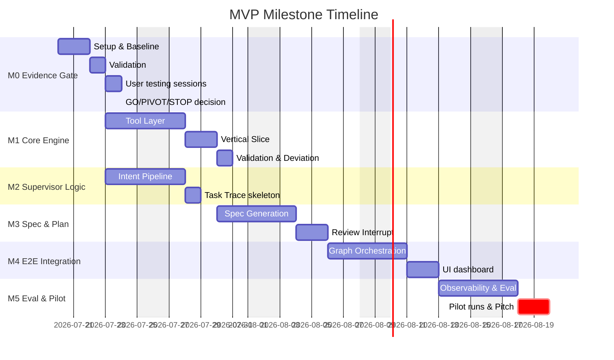

# PROGRESS.md — [Project Name] MVP

> [!IMPORTANT]
> **HACKATHON TEMPLATE & EXAMPLE**
> This file is a template and abstract example. Update all bracketed placeholders `[...]` with your actual hackathon project details.

> **Last updated:** [YYYY-MM-DD]  
> **Epic:** [Epic ID — Epic Title]  
> **Source of truth:** [e.g. MILESTONE.md · JTBD.md]

| Phase | Duration | Status |
|---|---|---|
| M0 — Evidence Gate | [3–5 days] | 🔲 Not started |
| M1 — [Core Engine / Component] | [5–7 days] | 🔲 Not started |
| M2 — [Supervisor Intent Classifier] | [4–6 days] | 🔲 Not started |
| M3 — [Spec/Plan Review Flow] | [5–7 days] | 🔲 Not started |
| M4 — [End-to-End Alpha Integration] | [7–10 days] | 🔲 Not started |
| M5 — [Trustworthy Pilot & Eval] | [5–7 days] | 🔲 Not started |

---

## 1. Work Breakdown Structure

### 1. M0 — Evidence Gate
- **1.1 Prototype setup**
  - 1.1.1 [Hard-coded Tool Harness / Mock environment]
  - 1.1.2 [Mock Spec/Plan preview UI (Wizard-of-Oz)]
- **1.2 Validation baseline**
  - 1.2.1 [Defect Type 1 detection]
  - 1.2.2 [Defect Type 2 detection]
- **1.3 User testing**
  - 1.3.1 [5–8 sessions with target users]
  - 1.3.2 [Evidence gate review: GO / PIVOT / STOP decision]

### 2. M1 — [Core Engine / Component V0]
- **2.1 [Tool Adapter Layer]**
  - 2.1.1 [Adapter code implementation]
  - 2.1.2 [Allowlist tool schemas]
- **2.2 [Vertical Slice Verification]**
  - 2.2.1 [Key manifest test runs]
- **2.3 [Validation & Deviation Policy]**
  - 2.3.1 [Validation Report output format]

### 3. M2 — [Supervisor Logic V0]
- **3.1 [Intent Classifier]**
  - 3.1.1 [Classifier: SIMPLE / COMPLEX routing]
  - 3.1.2 [Clarification Question Generator (<=3 questions)]
- **3.2 [Task Lifecycle and Activity Trace]**
  - 3.2.1 [Database trace schemas]

### 4. M3 — [Reviewable Spec/Plan V0]
- **4.1 [Spec/Plan Generation]**
  - 4.1.1 [Spec generation pipeline]
  - 4.1.2 [Plan generation pipeline (Non-dev plan + Technical plan)]
- **4.2 [Review Interrupt]**
  - 4.2.1 [Approval/Change Request trigger logic]

### 5. M4 — [End-to-End Alpha Integration]
- **5.1 [Graph Orchestration]**
  - 5.1.1 [LangGraph / State-machine implementation]
- **5.2 [Memory System]**
  - 5.2.1 [Persistent user and workspace context stores]

### 6. M5 — [Trustworthy Pilot & Eval]
- **6.1 [Observability & Evaluator]**
  - 6.1.1 [Langfuse tracing setup]
  - 6.1.2 [Offline scenario evaluation dataset (20-30 cases)]

---

## 2. Gantt Chart

---

## 3. Story Registry
| ID | Title | Milestone(s) | Lane | Status |
|---|---|---|---|---|
| [US-101] | [Task Lifecycle & Trace Skeleton] | M2 + M4 | normal | planned |
| [US-102] | [Intent Clarification Logic] | M2 | normal | planned |
| [US-103] | [Persistent Memory & Context Packs] | M4 + M5 | normal | planned |
| [US-104] | [Spec/Plan Generation] | M3 | normal | planned |
| [US-105] | [Review Interrupt Logic] | M3 | normal | planned |
| [US-106] | [Tool Layer Adapter] | M1 | normal | planned |
| [US-107] | [Vertical Slice Implementation] | M1 | high_risk | planned |
| [US-108] | [Validation & Deviation Policy] | M1 + M5 | normal | planned |
| [US-109] | [Evaluation Dataset & Observability] | M5 | normal | planned |
