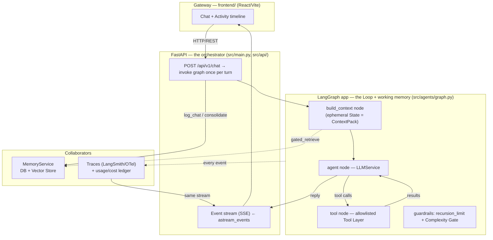

> [!IMPORTANT]
> **HACKATHON TEMPLATE & EXAMPLE**
> This file is a template and abstract example. Update all bracketed placeholders `[...]` with your actual hackathon project details.
> For a fully worked, domain-specific version, read [`workflow-mvp-example.md`](./workflow-mvp-example.md).
> For the harness-engineering reasoning behind the seams below, read [`.agents/archives/HARNESS-ENGINEERING-WORKFLOW.md`](./.agents/archives/HARNESS-ENGINEERING-WORKFLOW.md).

# Workflow MVP [Tên Dự Án] (Core Source of Truth)

## 0. Cách đọc tài liệu này (harness mental model)

Một LLM tự thân chỉ là hàm `text in → text out`. Sản phẩm của bạn là **harness** bọc quanh
hàm đó để biến nó thành một agent chạy được. Toàn bộ tài liệu này được tổ chức quanh bốn trụ
cột — **Harness · Loop · Memory · Eval/Ops** — và mọi phần đều mô tả một *seam* (đường ráp có
thể thay thế) thay vì một implementation cứng:

```text
bare model call        →     one agent turn
llm(prompt) -> text          gateway → assemble ContextPack → loop(reason/act)
                             → persist → trace → reply
```

Nguyên tắc thiết kế xuyên suốt: **mỗi thành phần đứng sau một interface**, để có thể đổi model,
đổi store, đổi orchestration mà không viết lại phần còn lại.

---

## 1. Mục tiêu MVP

Xây một AI Agent chuyên nhận yêu cầu [Nghiệp Vụ] bằng ngôn ngữ tự nhiên, làm rõ tối đa 2–3 câu
hỏi, tạo và quản lý các artifact yêu cầu, sau đó thực thi thông qua một **Tool Layer có kiểm soát**
và trả kết quả đã được kiểm chứng.

MVP tập trung chứng minh bốn giả thuyết:

1. **One turn, one place.** Một entrypoint duy nhất (`POST /api/v1/chat`) assemble context, chạy
   loop, persist và emit trace — không có control flow ẩn.
2. **Supervisor hiểu đúng intent** sau tối đa 2–3 câu hỏi và phân biệt đúng task đơn giản
   (auto-execute) với task cần review.
3. **The model is a swappable part.** Đổi provider/model chỉ là một env var, không phải rewrite.
4. **Everything is both shown and recorded.** Cùng một event stream vừa cấp cho UI live (activity
   timeline), vừa ghi vào trace bền vững — quan sát được by construction.

Thước đo thành công: **đọc hiểu được trong một buổi chiều**. Thành phần nào làm cho một turn khó
lần theo hơn thì không thuộc về harness core.

---

## 2. Kiến trúc tổng thể

Harness là vùng **Gateway → Orchestrator → Loop**; Memory và Ops là *collaborators* được gọi qua
seam hẹp (xem [`docs/ARCHITECTURE.md`](./docs/ARCHITECTURE.md)).



LangGraph chỉ chịu trách nhiệm về state, branching, interrupt và resume. **Các lớp domain không
được phụ thuộc trực tiếp vào LangGraph hoặc LangChain message types.** Các interface chính:

```python
Gateway          # moves text; calls the chat route with a `source` tag
Orchestrator     # one graph invocation per turn (assemble → loop → persist)
ContextBuilder   # builds the per-turn ContextPack (State), then discards it
LLMService       # anything behind init_chat_model(...) — provider-agnostic
ToolRegistry     # schemas() + execute(name, args) — safe tool dispatch
MemoryService    # gated_retrieve / matching_skills / log_chat / maybe_consolidate
Tracer/Observer  # (kind, event) -> None — live view AND durable trace
Settings         # one place; every knob is an env var
```

---

## 3. State machine chính (turn lifecycle)

Một lần gọi `chat()` đi qua state machine này. So sánh trực tiếp với `src/agents/graph.py`.

```text
RECEIVE_MESSAGE            gateway đưa text + source + observer
    ↓
OPEN_TRACE_TURN           trace_id + turn_start marker + root span
    ↓
BUILD_CONTEXT (ContextPack)
    ├─ load system policy / persona
    ├─ inject môi trường model không tự thấy (clock, tz, locale)
    ├─ GATED memory retrieve  ── cheap judge: "turn này có cần memory?"
    └─ match skills (procedural, keyword-triggered)
    ↓
CLASSIFY_INTENT           trích xuất intent + tham số
    ↓
IDENTIFY_MISSING_INFORMATION
    ├─ Thiếu → ASK_CLARIFYING_QUESTION (tối đa 2–3 câu)
    └─ Đủ / hết lượt hỏi → APPLY_EXPLICIT_DEFAULTS → WRITE USER_INTENT
    ↓
ASSESS_COMPLEXITY_AND_RISK  (policy code quyết định, không phải LLM)
    ├─ SIMPLE     → GENERATE_COMPACT_SPEC_PLAN → EXECUTE_AUTOMATICALLY
    ├─ BORDERLINE → ASK_USER_TO_CONFIRM_EXECUTION_MODE
    └─ COMPLEX    → GENERATE_SPEC → GENERATE_PLAN → PAUSE_FOR_REVIEW → APPROVE
    ↓
RUN_LOOP                  reason → act → observe → repeat (guardrails, §7)
    ↓
VALIDATE_OUTPUT          deterministic checks (PASS | RETRY | PAUSE_FOR_REAPPROVAL)
    ↓
PERSIST_EXCHANGE         history += turn; fold "[tools used: ...]" line in
    ↓
MAYBE_CONSOLIDATE        chỉ sau N chat — batched, off the reply path
    ↓
CLOSE_TRACE_TURN         turn_end marker + flush spans
    ↓
RETURN                   {answer, explanation, sources, trace_id, status}
```

Hai tính chất biến cái này thành *harness* chứ không chỉ là script:

- **Cả turn được bọc trong một trace context** — process bị kill vẫn để lại partial trace đọc được.
- **Persist / consolidate / validate xảy ra sau khi có reply nhưng vẫn trong cùng turn** — harness
  sở hữu bước "làm gì với kết quả", loop chỉ sở hữu thuật toán reason/act.

---

## 4. Vai trò của các thành phần

- **Gateway (`frontend/` + FastAPI route):** lớp mỏng nhất — đưa text vào, hiển thị reply, gắn
  `source`. **Không** chạm memory, tools hay model; không sở hữu turn logic. Thêm channel mới là
  *purely additive*.
- **Supervisor Agent:** phân loại intent, phát hiện thông tin thiếu, đặt câu hỏi làm rõ, đánh giá
  complexity/risk, quyết định `ACT` / `ASK` / `REVIEW_REQUIRED` / `DO_NOT_ACT`, quản lý version.
- **Spec Agent:** đọc `USER_INTENT.md` + memory để sinh `SPEC.md`. Không phỏng vấn lại user —
  clarification phải xong trước.
- **Plan Agent:** chuyển Spec thành `PLAN.md` hai lớp (bản dễ hiểu cho user + Technical Execution
  Plan cho máy).
- **Execution Agent:** đọc manifest đã duyệt, chỉ gọi tools trong allowlist. **Không chạy code tùy ý.**
- **Tracer/Observer:** vừa là loop observer, vừa bracket turn và giữ cost ledger.

---

## 5. Provider abstraction (one dialect, many providers)

Pattern harness dễ tái dùng nhất: **loop chỉ nói đúng một wire dialect**, provider cắm vào ở rìa.
Routing là *by job*, không hard-code model id.

```yaml
# resolved from env, không bao giờ hard-code trong domain logic
provider:     ${LLM_PROVIDER}       # [anthropic | openai | gemini | ...]
main_model:   ${LLM_MODEL}          # chạy loop chính
small_model:  ${LLM_SMALL_MODEL}    # retrieval gate + consolidation (rẻ)
```

Quy tắc nên copy:

- **Hai model mỗi provider: main + small.** Loop dùng main; gate/consolidation dùng small.
- **Model id chỉ là string**, override qua env — model bị khai tử không đụng tới code.
- **Một adapter hấp thụ khoảng cách format** (vd `init_chat_model` / OpenAI-compat), loop vô can.
- **Fail fast on config, timeout on network.** Provider lạ / thiếu key → dừng ngay với gợi ý sửa;
  mọi call đều có timeout.

Mỗi model response phải trả structured output được validate bằng Pydantic / JSON Schema.

---

## 6. Working-memory contract (ContextPack)

Mỗi turn, ContextBuilder dựng **chính xác** context model sẽ thấy — không gì ngầm, không gì global.

```yaml
context_pack:
  system_policy:        # persona + standing rules (editable)
  injected_env:         "Right now it is <local time> (<tz>)"   # model không tự thấy → tiêm vào
  gated_memory:         "Relevant memory: ..."   | (bỏ nếu gate nói skip)
  skills:               "Relevant skills: ..."   | (bỏ nếu không match)
  latest_user_intent:   # approved USER_INTENT.md (theo version, không copy lặp)
  approved_artifacts:   # SPEC/PLAN references
  allowed_tools:        # chỉ tools liên quan tới node này
  history:              [ {role, content}, ... ]
  output_schema:        # structured output bắt buộc
  token_budget:
```

Hai quyết định đáng học:

- **Tiêm môi trường model không thấy được.** Đồng hồ máy đi *vào* prompt để model tự giải quyết
  "trong 30 phút nữa" thay vì hỏi lại user — một bug harness sửa by construction.
- **Memory là gated, không default-on.** Block chỉ xuất hiện khi một cheap judge nói turn cần nó.
  Default-on retrieval vừa chậm vừa nhiễu câu trả lời.

Thứ tự ưu tiên context (cao nhất trước):

```text
current explicit user instruction
> injected environment (clock, tz, locale)
> system policy / persona
> approved USER_INTENT.md
> approved SPEC.md > approved PLAN.md
> gated relevant memory (chỉ khi gate retrieve)
> matching skills (chỉ khi keyword match)
> this session's chat history
```

---

## 7. Loop guardrails & exit conditions

Harness *drives* loop nhưng loop tự sở hữu điều kiện dừng. Hình dạng chuẩn:

```python
for iteration in range(1, max_iterations + 1):
    response = llm(messages, tools)          # reason
    messages.append(assistant_turn)
    tool_uses = [b for b in response if b.type == "tool_use"]
    if not tool_uses:                        # ── guardrail 1: natural end
        return LoopResult(reply=text, iterations=iteration)
    for call in tool_uses:                    # act
        output = tools.execute(call.name, call.input)   # safe: lỗi → text
        notify("tool", {...})                 # observe (live + trace)
    messages.append(tool_results)             # feed back as working memory
# ── guardrail 2: hết iteration → hard stop, honest message
return LoopResult(reply="(hit iteration limit — try smaller steps)")
```

| Failure mode | Guardrail |
|---|---|
| Model gọi tool không dừng | `max_iterations` / `recursion_limit` → hard stop |
| Một tool raise | `ToolRegistry.execute` trả lỗi dưới dạng text; loop tiếp tục, model retry |
| Streaming hiccup | fallback sang một `create()` không streaming |
| Hung network call | client-level timeout (`LLM_TIMEOUT`) |
| Cost/size runaway | `max_tokens` mỗi call |

`max_iterations` và `max_tokens` là **harness config** (§15), không phải hằng số của loop — harness
sở hữu safety envelope, loop sở hữu thuật toán. **Complexity Gate** là guardrail nghiệp vụ: task
high-risk phải rẽ sang review, không auto-execute.

---

## 8. Tool Layer & the tool contract

Tool là ba thứ, không hơn:

```python
@dataclass
class Tool:
    name: str            # model đọc cái này
    description: str     # khi nào dùng — hướng dẫn duy nhất cho model
    input_schema: dict   # JSON schema cho arguments
    fn: Callable[..., str]   # chạy nó; trả string model quan sát
```

Registry cho harness hai thao tác — `schemas()` (payload `tools=`) và `execute(name, args)` (chạy
an toàn). **Safety là đóng góp của harness:**

```python
def execute(self, name, args):
    tool = self._tools.get(name)
    if tool is None:
        return f"Error: unknown tool '{name}'"     # tool lạ → text, không crash
    try:
        return tool.fn(**args)
    except Exception as exc:
        return f"Error running {name}: {exc}"       # tool bug → text, model retry
```

Vì tool fail trở thành *observation* (text quay lại loop), loop không bao giờ crash vì tool bug.
Tool ngoài (DB, file generator, [domain tool]) phải có schema in/out rõ ràng và nằm trong
**allowlist**; có thể đến từ local function hoặc MCP server — cùng contract.

---

## 9. Previewer & review flow (human-in-the-loop)

Sidebar hiển thị các artifact theo version: `USER_INTENT.md`, `SPEC.md`, `PLAN.md`,
`VALIDATION_REPORT.md`, và output. Các nút tối thiểu: `Approve & Run`, `Request Changes`,
`View Diff`, `View Assumptions`, `View Previous Version`. User không sửa trực tiếp Markdown trong MVP.

```text
User gửi yêu cầu sửa qua chat
→ Supervisor xác định artifact bị ảnh hưởng
→ Tạo version mới → Hiển thị change summary + line diff
→ User Approve & Run → resume graph từ checkpoint
```

Trạng thái artifact: `draft → awaiting_review → changes_requested → approved → superseded`.
Trạng thái task: `created → clarifying → planning → awaiting_review → approved → executing →
validating → completed | failed | paused_for_reapproval`.

---

## 10. Deviation policy

**Technical deviation** (agent tự xử lý nếu KHÔNG đổi kết quả user đã duyệt): đổi thứ tự tool call,
tách operation, thêm validation, retry tham số tương đương, chuẩn hóa identifier nội bộ.

```text
Decision: CONTINUE · Reapproval: false · Trace event: TECHNICAL_DEVIATION
```

**User-visible deviation** (bắt buộc pause): thêm/xóa/đổi tên output-visible field, đổi công thức
nghiệp vụ, đổi ngưỡng, đổi assumption, đổi nguồn dữ liệu, đổi phạm vi.

```text
Decision: PAUSE_FOR_REAPPROVAL → SPEC/PLAN version mới → diff → user Approve → resume
```

---

## 11. Persistent Memory & context management

Boundary với Memory cố tình hẹp — harness chỉ biết bốn động từ:

```python
memory.gated_retrieve(user_message, notify=...)   # trong build_context — có thể trả ""
memory.matching_skills(user_message)              # procedural
memory.log_chat(user_message, record, source=...) # persist turn
memory.maybe_consolidate(notify=...)              # sau reply — batched distillation
```

Mọi thứ sau bốn call đó — FTS5 vs pgvector, gate model, schema — vô hình với harness. Ba lớp memory:

- **User Preference Memory:** sở thích chung (ngôn ngữ, múi giờ, định dạng).
- **Workspace Memory:** quy ước ổn định của dự án.
- **Episodic Memory:** chỉ tóm tắt task, spec version, outcome, bài học. **KHÔNG lưu dữ liệu nhạy
  cảm của khách hàng.**

Quy tắc budget: gate trước khi load; mỗi section chỉ thêm khi có nội dung; small model chạy
gate/consolidation; nén tool activity cũ thành một dòng `[tools used: ...]`. Không có context
always-on khổng lồ để cắt.

---

## 12. Observability — event stream (shown AND recorded)

Đây là hệ thần kinh của harness. **Một** event stream phục vụ *cả* live view *và* durable record,
đảm bảo trùng khớp by construction:

```python
notify = compose(observer, tracer.event)   # fan một event ra N sink
```

Event kinds: `turn_start · gate · llm · text(delta, chỉ UI) · tool · consolidation · turn_end`.

Hai output từ *cùng* events:

1. **JSONL / trace always-on** — append `{type, ...}` mỗi event; mở ra đọc turn theo thứ tự,
   zero dependency.
2. **OTel spans khi có endpoint** — cùng events dưới dạng span tree cho Phoenix / LangSmith.

Quy tắc:

- **`text` deltas cho người, không vào trace** — log là "what happened", không phải token replay.
- **Usage được ghi mỗi `llm` event** vào ledger permanent (resettable trace tách khỏi cost ledger).
- **Một turn = một root span + turn_start/turn_end**, flush mỗi turn.
- Trace hiển thị **structured activity**, không phải raw chain-of-thought.

---

## 13. Determinism seams (làm harness test được)

Đặt swap ở **rìa** (LLM client, DB connection), giữ **giữa** (assemble → loop → persist) giống hệt
nhau cho prod và test.

```python
# Dependency injection qua FastAPI Depends
def chat(request, llm = Depends(get_llm), db = Depends(get_db)):
    # test: truyền scripted FakeLLM → "đúng tool có bắn không?" thành 0/1 unit test
    ...
```

- **Deterministic tests drive real turns.** Chỉ model bị fake; loop, tool dispatch, persistence
  chạy thật.
- **Một seam, nhiều caller.** Cùng chỗ inject phục vụ cả eval lẫn dashboard — không có nhánh
  test-only trong `chat()`.

---

## 14. Error handling & fallback policy

Giữ một turn *honest* dưới lỗi, không bao giờ giấu.

```text
Recover silently (trace lại):
  Streaming error        → một non-streaming call
  Tool raises            → "Error running <tool>: <exc>" → model retry
  Consolidation fails    → chat log chưa consolidate (loss-safe), reply không ảnh hưởng

Fail fast (người phải sửa config):
  Unknown LLM_PROVIDER   → dừng với danh sách hợp lệ
  Missing API key        → dừng, nêu tên env var

Degrade honestly (báo user):
  max_iterations reached → "(hit iteration limit — try smaller steps)"
  LLM timeout            → surfaced, không nuốt
```

Với client, **không bao giờ leak internals**: lỗi trả về envelope chung `{status:"error",
trace_id, message}`; exception được log server-side kèm cùng `trace_id`. (Xem
`tests/unit/test_chat_contract.py`.)

---

## 15. Tech stack MVP

```yaml
frontend:
  framework: React / Vite (hoặc Next.js)
  functions: [chat, SSE activity stream, artifact preview/diff, approve & request changes]

backend:
  framework: FastAPI
  validation: Pydantic
  streaming: Server-Sent Events

orchestration:
  framework: LangGraph
  persistence: [SQLite | PostgreSQL] checkpointer
  guardrails: recursion_limit + max_tokens + Complexity Gate

model_access:
  routing: env vars (LLM_PROVIDER / LLM_MODEL / LLM_SMALL_MODEL)
  contract: structured output validated by Pydantic

database:
  primary: [SQLite (dev) | PostgreSQL]
  usage: [tasks, checkpoints, memory, artifact metadata, review versions, events, eval results]

observability:
  always:   JSONL traces + append-only usage/cost ledger
  optional: OpenTelemetry → LangSmith / Phoenix

config:
  everything: one settings source, read once at startup

not-in-mvp:
  - no multi-agent / sub-agents
  - no message queue, no k8s
  - no vector DB until gated retrieval proves it's needed
```

North star: **mỗi lớp có default zero-signup + đường nâng cấp có tài liệu** (SQLite → Postgres,
JSONL → LangSmith, mock → real).

---

## 16. Eval plan & release gates

Bắt đầu bằng 10–30 scenario đa dạng, đọc trace thủ công, ghi failure mode, chọn golden outputs
trước khi xây eval phức tạp (vibe check → offline eval → production monitoring).

**Tách bạch** hai loại check — trộn chúng là lỗi eval phổ biến nhất:

```text
Deterministic (0/1) — "wiring có làm đúng việc không?"
  đúng tool bắn · turn_start..turn_end emit đủ · source tag đúng · tool raise → text
  · guardrail 1 (no-tool → dừng) · guardrail 2 (tool-happy → max_iterations)
  · không leak internals · usage ledger có một dòng mỗi llm event

Judged (%) — "câu trả lời có tốt không?"
  chỉ dùng cho tiêu chí cần judgment (human hoặc LLM-judge sau khi có calibration set)
```

Release gate v0 (template — thay ngưỡng theo domain):

```yaml
block_if:
  p0_failures: "> 0"
  internal_field_leak_cases: "> 0"
  undisclosed_assumptions: "> 0"
  [domain_correctness_rate]: "< [threshold]"
warn_if:
  average_clarification_questions: "> 3"
  retry_rate: "> 0.15"
  average_latency_seconds: "> [target]"
  average_cost_usd: "> [budget]"
```

**Bug workflow:** bắt được bug harness khi dùng live → *fix nó VÀ thêm một deterministic case* để
nó không quay lại. Chạy release gate → xanh.

---

## 17. Implementation roadmap (vertical slices)

Mỗi ticket là một slice demo được, không phải một tầng ngang.

```text
Ticket 1 — Config + one model client + turn skeleton
           Prove: một call llm(messages) trả text. No blocker.
Ticket 2 — The loop + tool registry (cả hai guardrail, safe execute)
           Prove: turn một-tool cho iter 2 (reason → act → reason). Blocked by 1.
Ticket 3 — Orchestrator + ContextPack assembly (system + clock + history)
           Prove: hội thoại nhiều lượt nhớ được lượt trước. Blocked by 2.
Ticket 4 — Observer + tracer (event stream, JSONL + usage ledger, SSE live)
           Prove: đọc lại một turn từ trace. Blocked by 3.
Ticket 5 — Gateway (frontend + chat route)
           Prove: hội thoại thật, tool calls stream qua activity timeline. Blocked by 4.
Ticket 6 — Provider abstraction (adapter + provider table)
           Prove: cùng hội thoại trên provider thứ hai qua một env var. Blocked by 1.
Ticket 7 — Memory boundary (gated_retrieve / log_chat / maybe_consolidate)
           Prove: "remember X" → restart → recalled. Blocked by 3.
Ticket 8 — Spec/Plan + review interrupt (versioning, diff, approve & run)
           Prove: complex task dừng chờ duyệt rồi resume. Blocked by 5.
Ticket 9 — Validation + deviation policy + eval harness + release gate
           Prove: `make check` / release gate xanh. Blocked by 7, 8.
```

---

## 18. Good for Later

- Sub-agents / delegate_task (giữ core single-agent, dễ đọc).
- Terminal / code-execution tool — cần sandbox + safety surface trước.
- pgvector semantic memory sau bốn-verb boundary hiện tại.
- Span-waterfall (OTel/LangSmith) từ optional lên first-class.
- Streaming everywhere; backpressure / rate-limit giữa các gateway.
- Structured redaction trước khi export trace chứa payload nhạy cảm.
- LLM-as-judge sau khi có human-labeled calibration set.
- Role-based access control; collaborative review nhiều người.

Scope này đủ nhỏ để xây trong một đêm nhưng vẫn chứng minh toàn chuỗi giá trị:
**nhận từ bất kỳ channel → assemble context chính xác → drive loop với guardrails → dispatch tool
an toàn → gọi memory qua seam hẹp → ghi mọi event vừa live vừa durable → validate → trả reply honest.**
