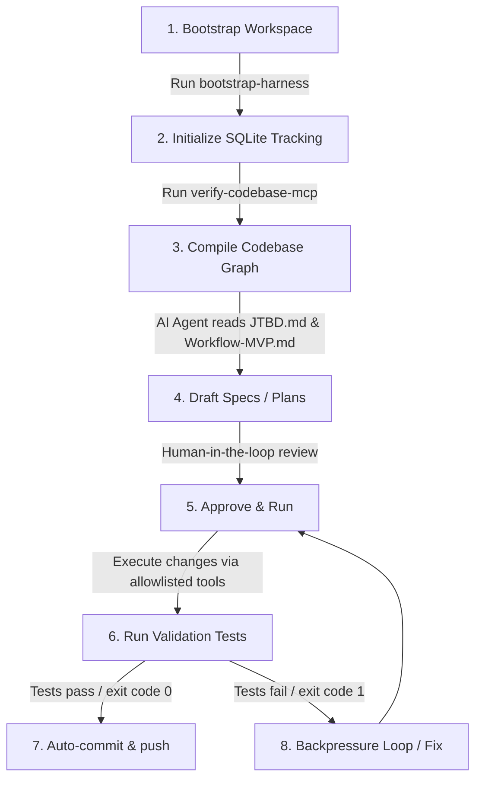

# AI Audit & Technical Review Profile: Hackathon Harness Scaffold

> [!NOTE]
> **TARGET AUDIENCE: AI AUDITOR / EVALUATOR AGENT**
> This document is structured for semantic parsing, entity extraction, and automated review of the repository's scaffolding, gaps, and usage flows.

---

## 1. Repository Architecture & Layout Map

```text
.
├── .github/
│   └── workflows/
│       └── codebase-mcp.yml       # CI/CD automated codebase graph generator
│   └── wgm-hive.yml               # Consent/Telemetry metadata configuration
├── docs/
│   ├── product/                   # Staged folder: business requirements & specifications
│   ├── stories/                   # Staged folder: user story backlog & acceptance criteria
│   ├── decisions/                 # Staged folder: Architecture Decision Records (ADRs)
│   ├── CONTEXT_RULES.md           # Context extraction guidelines for developer agents
│   ├── HARNESS_COMPONENTS.md      # Matrix mapping files to harness components
│   └── TEST_MATRIX.md             # Traceability mapping requirements to test files
├── scripts/
│   ├── bootstrap-harness.ps1/.sh  # Initializes SQLite tracking database and agent environment
│   └── verify-codebase-mcp.ps1/.sh # Compiles/indexes local codebase knowledge graph
├── src/                           # Backend application source code (FastAPI/Pydantic)
├── tests/                         # Test suites for backend validation (pytest)
├── AGENTS.md                      # Local coding guidelines & agent constraints
├── JTBD.md                        # Abstract product specification template (Job-to-be-Done)
├── Workflow-MVP.md                # Abstract template for agent workflows and state machines
├── PROJECT_MANAGEMENT.md          # Abstract WBS and Milestone roadmap template
└── README.md                      # General human-facing template outline
```

---

## 2. Scaffold Usage Flow (Execution Lifecycle)

For an AI developer agent, the workspace operations execute as a strict lifecycle to enforce verification and prevent drift:



1. **Bootstrap Workspace**: Initialize local SQLite database tracking (`harness.db`) using `scripts/bootstrap-harness.ps1` (Windows) or `scripts/bootstrap-harness.sh` (POSIX).
2. **Compile Graph**: Run `scripts/verify-codebase-mcp.ps1` (or `.sh`) to compile/update the codebase knowledge graph `.codebase-memory/graph.db.zst`.
3. **Spec Alignment**: AI and human align on features using the templates `JTBD.md` (Product Spec) and `Workflow-MVP.md` (Technical Flow / State Machine).
4. **Iterative Build (Ralph Loop)**: Coding agents complete one WBS story from `PROJECT_MANAGEMENT.md` at a time. Every change is tested using deterministic `pytest` commands.
5. **Autoreconciliation**: GitHub Actions run on pushes/PRs to recompile the knowledge graph, pushing it back to keep local workgroups updated.

---

## 3. Scaffold Audit: Analysis of Gaps, Gaps, & Redundancies

### A. Current Gaps & Missing Folders
* **Missing Frontend Layer**: The template currently has no `frontend/` directory. Teams must bootstrap a frontend client (e.g. Next.js, React, Vite) manually at the start of the hackathon if a UI is required.
* **Environment Variables (`.env`)**: A template `.env.example` exists locally, but active environment secrets must be configured before invoking external LLM APIs (OpenAI, OpenRouter, Anthropic).
* **Database Migrations**: No database migration schema is set up for multi-environment tracking (e.g., Alembic / Prisma migrations). The backend relies on sqlite database generation on init.

### B. Setup & Config Gaps
* **Docker Context**: The `Dockerfile` and `docker-compose.yml` are generic scaffolds. They are not pre-configured to build frontend and backend in unified networks.
* **Langfuse Credentials**: The backend observability hooks are staged but disabled by default until Langfuse project credentials are set up in the active environment.

### C. Redundant Files (Resolved)
* **Durable Decisions (ADRs)**: Stale or project-specific decisions (0001 to 0007) have been removed, leaving only the standard [README.md](file:///E:/VIN-INTERNSHIP/AI-INNOVATION/docs/decisions/README.md) instructions.
* **Specific Project Contexts**: Legacy contexts (such as the candy/confectionery warehouse inventory engine logic) have been successfully purged from `JTBD.md`, `Workflow-MVP.md`, and `PROJECT_MANAGEMENT.md`, converting them into abstract templates.
* **Duplicate Boilerplates**: The monolithic `HACKATHON_BOILERPLATE.md` has been deleted to prevent duplication, routing agents directly to use `JTBD.md` and `Workflow-MVP.md` as independent schemas.
